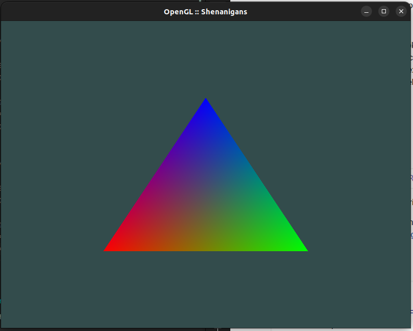

# OpenGL.rs

Low level implementation of OpenGL calls in Rust (rewriting [OpenGL Shenanigans](https://github.com/felbit/opengl-shenanigans)) for fun and pleasure.

## Current State

## Roadmap
- [x] Window inititalization (with SDL2)
- [x] Shader parsing
- [x] Shader linking
- [x] Vertex drawing
- [x] ... with colors
- [ ] Textures
- [ ] 3D Camera with Controls
- [ ] Basic Lighting
- [ ] Material
- [ ] Lighting Maps
- [ ] Light Casters
- [ ] Multiple Lights
- [ ] Model loading (.obj models)
